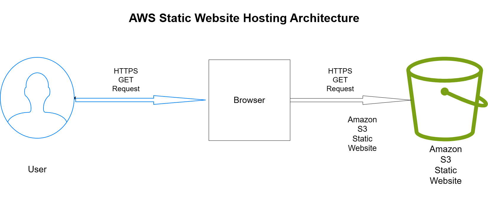
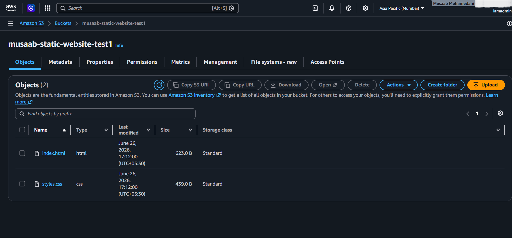
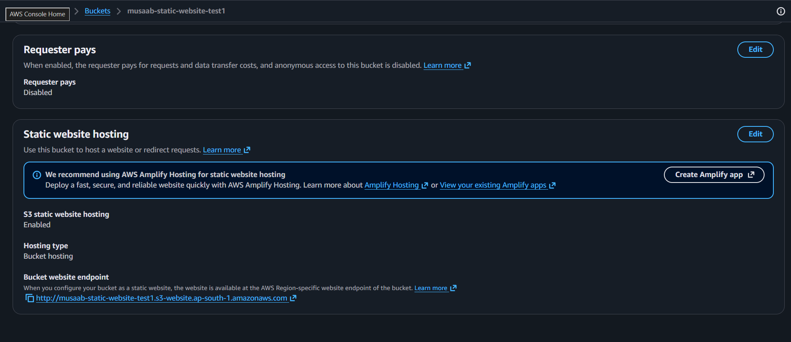
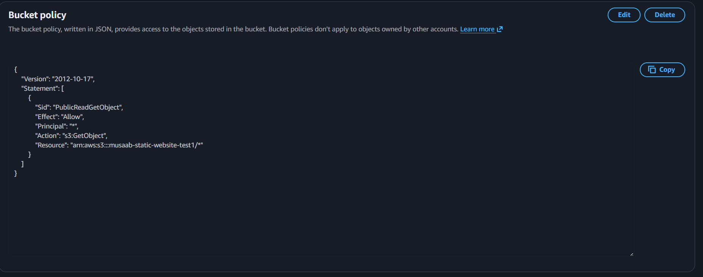
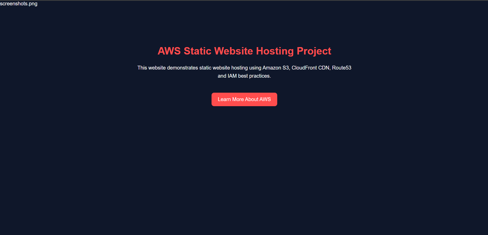

# AWS Static Website Hosting

## Project Overview

This project demonstrates how to deploy and host a static website using **Amazon S3 Static Website Hosting**.

The website is built with HTML and CSS, uploaded to an Amazon S3 bucket, and made publicly accessible using a secure bucket policy.

This project was created as part of my Cloud & DevOps portfolio while preparing for real-world AWS engineering roles.

---

## Architecture



---

## Project Structure

```text
aws-static-website-hosting
│
├── README.md
├── architecture
│   └── aws-static-website-hosting-diagram.png
├── screenshots
│   ├── bucket-objects.png
│   ├── bucket-policy.png
│   ├── static-website-hosting.png
│   └── website-live.png
└── website
    ├── index.html
    └── styles.css
```

---

## AWS Services Used

### Amazon S3

* Static website hosting
* Object storage
* Website endpoint
* Public content delivery

### AWS IAM

* Administrative access for deployment
* AWS Management Console

### S3 Bucket Policy

* Public read access
* Least privilege permissions
* Secure object access

---

## Deployment Steps

1. Create an Amazon S3 bucket.
2. Upload `index.html` and `styles.css`.
3. Enable Static Website Hosting.
4. Configure the bucket policy for public read access.
5. Verify the website using the S3 website endpoint.

---

## Architecture Workflow

1. User opens the website URL.
2. Browser sends an HTTP request.
3. Amazon S3 serves the static website files.
4. HTML and CSS are delivered to the browser.
5. The website is displayed to the user.

---

## Screenshots

### S3 Bucket Objects



### Static Website Hosting



### Bucket Policy



### Live Website



---

## Skills Demonstrated

* Amazon S3
* Static Website Hosting
* AWS Storage Services
* Bucket Policies
* AWS Console
* Cloud Architecture
* Web Deployment
* Basic Cloud Security

---

## Future Improvements

* Configure Amazon CloudFront
* Add HTTPS using AWS Certificate Manager (ACM)
* Connect a custom domain with Amazon Route 53
* Automate deployment using GitHub Actions
* Deploy infrastructure using Terraform

---

## Author

**Musaab Mohamedani**

AWS Certified Solutions Architect – Associate (SAA-C03)

GitHub: https://github.com/Mus7ab

LinkedIn: https://www.linkedin.com/in/musaab-mohamedani-3b2b72337
